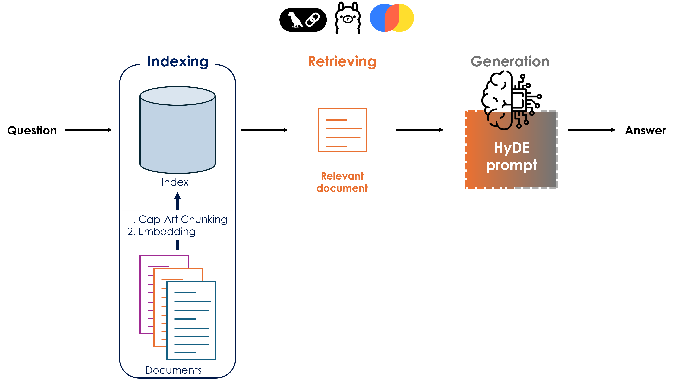

# CapArt-RAG
Regulatory Affair's RAG with Local LLM and HyDE

## Introduction
Welcome to CapArt-RAG, a **Retrieval-Augmented Generation (RAG)** framework tailored for navigation complex regulatory documents. This project is designed for in-house technical compliance teams who need to quickly locate, trace, and understand regulatory provisios within the large and complex PDFs documents. By detecting structural markers, such as in this case "Capítulos" and "Artículos" of spanish regulatory text during information ingestion, the system enriches each chunk with precise metadata, improving relevant document retrieving, ensuring transparent source attribution and minimizing hallucinations. 
Our implementation uses:
 * **LangChain** pipelines that integrate HyDE's hypothetical expansion and retrieval chains
 * **ChromaDB** as a local vector store
 * **Local LLM via Ollama** ensuring complete data privacy and offline usage

This repository provides the end-to-end codebase and documentation to ingest PDF regulations, preprocess and index them, and execute accurate, traceable queries.
